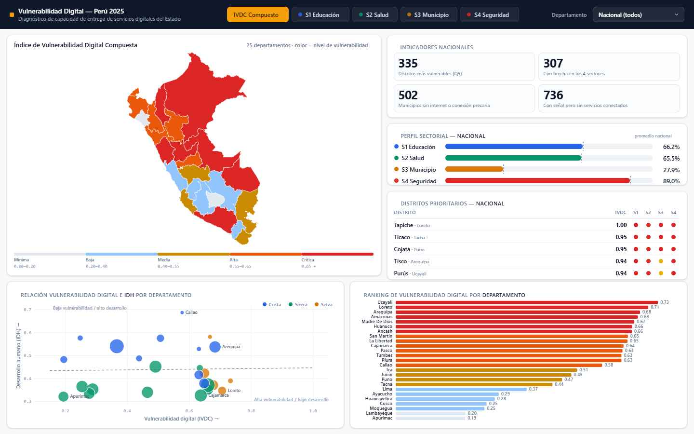
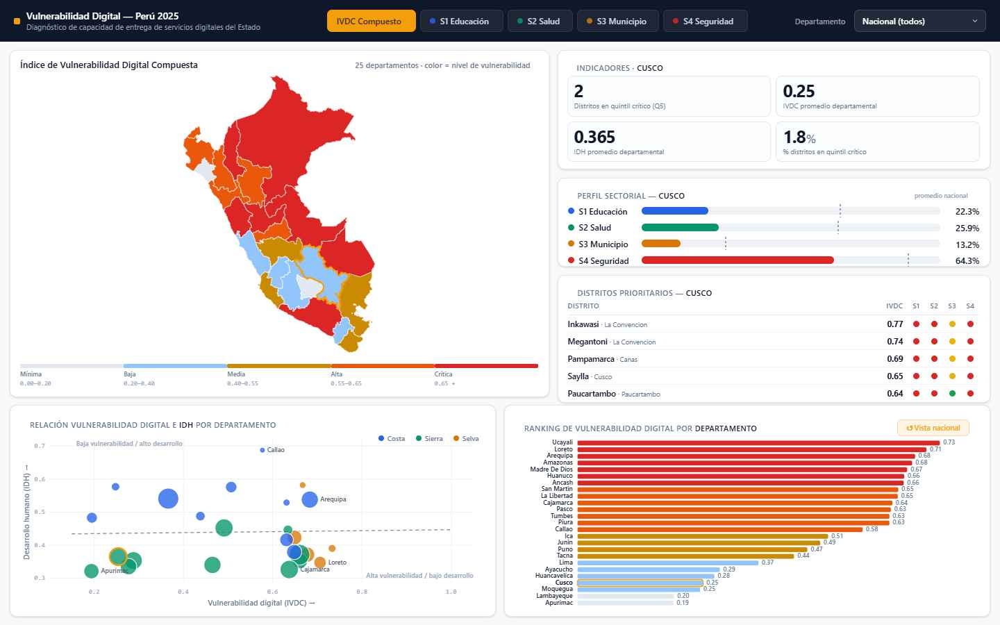
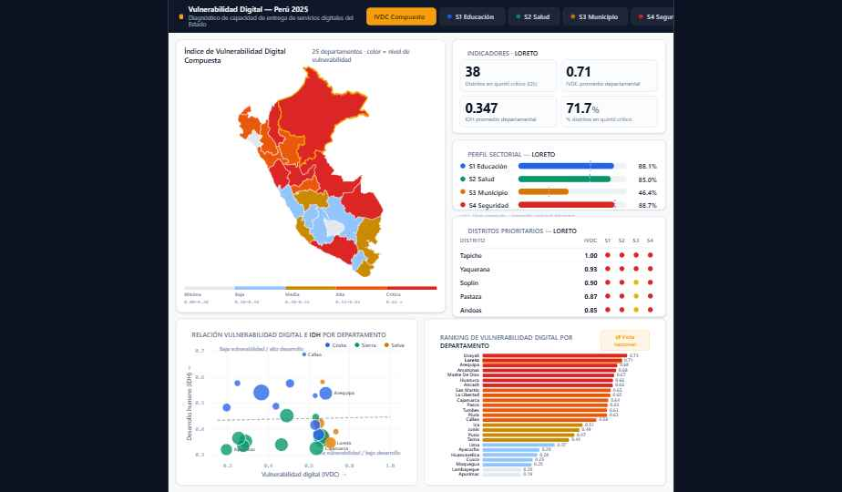
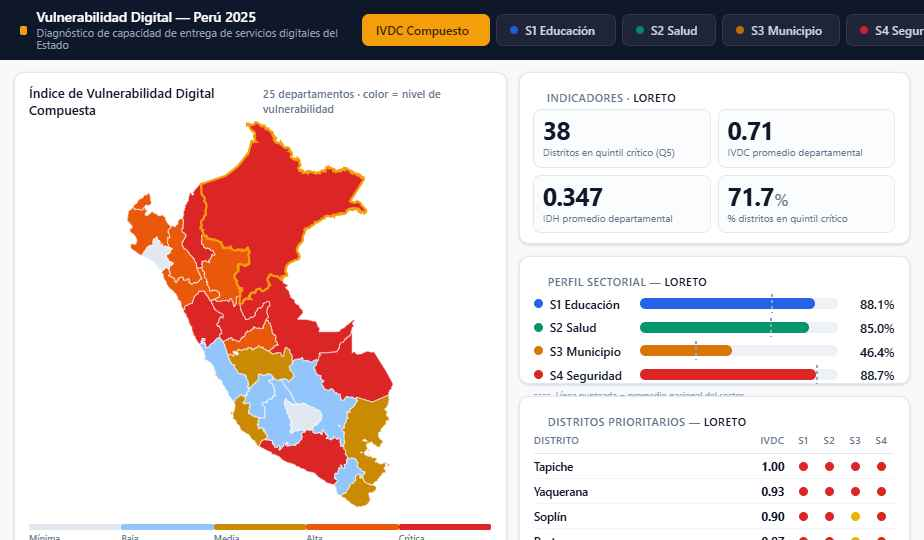

# GEOTON Perú 2026 — Índice de Vulnerabilidad Digital Compuesta (IVDC)

Dashbord interactivo e índice compuesto que diagnostica la capacidad del Estado peruano para prestar servicios digitales en los **1 874 distritos del Perú**, combinando datos abiertos de PRONATEL, MINEDU, MINSA, PNP, RENAMU y OSIPTEL.

## Tabla de contenidos

- [Descripción general](#descripción-general)
- [Metodología IVDC](#metodología-ivdc)
- [Estructura del repositorio](#estructura-del-repositorio)
- [Dashboard](#dashboard)
- [Pipeline ETL](#pipeline-etl)
- [Datos procesados](#datos-procesados)
- [Requisitos e instalación](#requisitos-e-instalación)
- [Uso](#uso)
- [Resultados principales](#resultados-principales)
- [Tecnologías](#tecnologías)
- [Fuentes de datos](#fuentes-de-datos)
- [Licencia](#licencia)

## Descripción general

El **IVDC** mide la vulnerabilidad digital de cada distrito peruano en una escala **[0, 1]** (mayor = más vulnerable) a partir de cuatro sectores críticos:

| Sector | Dimensión | Fuente |
|--------|-----------|--------|
| **S1 — Educación** | Brecha de conectividad en escuelas públicas | PRONATEL / MINEDU |
| **S2 — Salud** | Brecha de conectividad en establecimientos de salud | PRONATEL / MINSA |
| **S3 — Municipalidad** | Capacidad digital del gobierno local | RENAMU 2025 |
| **S4 — Seguridad** | Presencia policial conectada | PRONATEL / PNP |
| **BASE** | Cobertura de señal móvil | OSIPTEL Q1 2025 |

## Metodología IVDC

Cada sector se normaliza con **Min-Max scaling** a [0, 1] (mayor = peor). La fórmula del índice compuesto es:

```
IVDC_sectorial = promedio(S1_norm, S2_norm, S3_norm, S4_norm)
IVDC_raw       = IVDC_sectorial × (1 + 0,30 × BASE_norm)
IVDC_v2        = (IVDC_raw − min) / (max − min)     → renormalizado a [0, 1]
```

El factor **0,30 × BASE_norm** penaliza a los distritos sin cobertura móvil, amplificando su vulnerabilidad sectorial.

## Estructura del repositorio

```
GEOTON PERUVFINAL/
├── index.html                  # Dashboard interactivo (una sola página)
├── app.js                      # Lógica de visualización con D3.js
├── data.json                   # Datos compilados del dashboard
│
├── pipeline/                   # Scripts Python ETL
│   ├── 01_procesar_idh_distrital.py
│   ├── 02_procesar_cobertura_distrital.py
│   ├── 03_procesar_dependencias_policiales.py
│   ├── 03_procesar_pronatel_distrital.py
│   ├── 03_procesar_salud_escuelas.py
│   ├── 04_procesar_renamu_distrital.py
│   └── contruir_ivdc.py
│
├── data/
│   ├── processed/              # Outputs finales del pipeline
│   │   ├── ivdc_v2_distrital_final.csv        # 1 874 distritos
│   │   ├── ivdc_v2_tabla_departamental.csv    # 25 departamentos
│   │   └── ivdc_v2_reporte_metodologico.txt   # Reporte metodológico
│   └── raw/                    # Datos fuente (shapefiles, CSVs)
│
├── uploads/                    # Versiones del data.json del dashboard
├── screenshots/                # Capturas del dashboard
├── IVDC_Geoton_Peru_2026.pdf   # Presentación final del proyecto
└── diccionario metadatos ivdc.pdf  # Diccionario de metadatos
```

## Dashboard

El dashboard es una aplicación **HTML/CSS/JS** de página única que carga `data.json` y dibuja:

- **Mapa coroplético** de Perú por departamentos
- **KPIs nacionales** (IVDC promedio, distritos críticos, brecha cuádruple)
- **Perfil sectorial** con puntajes S1–S4
- **Tabla de distritos** con filtro por departamento
- **Gráfico de dispersión** IVDC vs IDH
- **Ranking de barras** por departamento

Se puede filtrar por variable (IVDC compuesto o sectores S1–S4) y hacer clic en un departamento para ver su detalle.

### Capturas

| Mapa general | Desagregación por departamento |
|:---:|:---:|
|  |  |
| **Loreto** | **Zoom** |
|  |  |

## Pipeline ETL

Los scripts Python en `pipeline/` procesan datos georreferenciados y producen los insumos para el IVDC:

| Script | Entrada | Salida | Propósito |
|--------|---------|--------|-----------|
| `01_procesar_idh_distrital.py` | IDH shapefile → CSV | `01-ok-idh_distrital_limpio.csv` | Limpieza y análisis del IDH distrital (PNUD 2019) |
| `02_procesar_cobertura_distrital.py` | Cobertura móvil + ubigeos | `02-ok-cobertura_movil_distrital_limpio.csv` | Agregación de cobertura a nivel distrital |
| `03_procesar_dependencias_policiales.py` | Comisarías | `03-ok-dependencias_policiales_distrital_limpio.csv` | Conteo y estado operativo de comisarías |
| `03_procesar_pronatel_distrital.py` | Localidades beneficiarias PRONATEL | `03-ok-pronatel_localidades_distrital_limpio.csv` | Cobertura de conectividad por localidad |
| `03_procesar_salud_escuelas.py` | Escuelas + salud PRONATEL | `03-ok-escuelas_distrital_limpio.csv`, `03-ok-salud_distrital_limpio.csv` | Brecha de conectividad en escuelas y salud |
| `04_procesar_renamu_distrital.py` | RENAMU 2025 | `04-ok-renamu_distrital_limpio.csv` | Capacidad digital municipal |
| `contruir_ivdc.py` | Todos los `*-ok-*.csv` | `ivdc_v2_distrital_final.csv`, `tabla_departamental.csv`, `reporte_metodologico.txt` | **Construcción del índice compuesto IVDC v2** |

## Datos procesados

| Archivo | Filas | Columnas | Descripción |
|---------|-------|----------|-------------|
| `ivdc_v2_distrital_final.csv` | 1 874 | 26 | IVDC, S1–S4, BASE, IDH, quintiles, brechas por distrito |
| `ivdc_v2_tabla_departamental.csv` | 25 | 12 | IVDC e IDH agregados por departamento, ranking |
| `ivdc_v2_reporte_metodologico.txt` | — | — | Documentación completa de la metodología y análisis de correlaciones |

## Requisitos e instalación

### Python

El pipeline requiere Python 3 y las siguientes dependencias:

```bash
pip install pandas numpy openpyxl scipy scikit-learn statsmodels
```

### Dashboard

No requiere instalación. Solo abre `index.html` en un navegador moderno o sírvelo localmente:

```bash
python3 -m http.server 8000
# -> http://localhost:8000
```

## Uso

Ejecutar los scripts del pipeline en orden:

```bash
cd pipeline

python 01_procesar_idh_distrital.py
python 02_procesar_cobertura_distrital.py
python 03_procesar_dependencias_policiales.py
python 03_procesar_pronatel_distrital.py
python 03_procesar_salud_escuelas.py
python 04_procesar_renamu_distrital.py
python contruir_ivdc.py
```

Para actualizar el dashboard después de regenerar los datos, reemplaza `data.json` con los nuevos outputs.

## Resultados principales

- **Departamento más vulnerable**: Ucayali (0,733), Loreto (0,706), Arequipa (0,683)
- **Departamento menos vulnerable**: Apurímac (0,194), Lambayeque (0,195), Moquegua (0,248)
- **335 distritos** en el quintil crítico (Q5)
- **307 distritos** con brecha cuádruple (los 4 sectores vulnerables)
- **502 municipalidades** sin internet o con conexión precaria
- Correlación negativa fuerte entre IVDC e IDH (Pearson r ≈ −0,6)

## Tecnologías

- **Python**: pandas, numpy, scikit-learn, scipy, statsmodels, openpyxl
- **Frontend**: HTML5, CSS3, D3.js v7, TopoJSON
- **Datos**: Shapefiles (EPSG:4326), GeoJSON, CSVs

## Fuentes de datos

| Fuente | Datos | Periodo |
|--------|-------|---------|
| [PRONATEL](https://www.datosabiertos.gob.pe/) | Infraestructura de conectividad escolar, salud, policial y localidades beneficiarias | 2022 |
| [RENAMU](https://www.datosabiertos.gob.pe/) | Encuesta Nacional de Municipalidades | 2025 |
| [OSIPTEL](https://www.osiptel.gob.pe/) | Cobertura móvil por centro poblado | Q1 2025 |
| [PNUD](https://www.pe.undp.org/) | Índice de Desarrollo Humano distrital | 2019 |
| [INEI](https://www.inei.gob.pe/) | Lista oficial de ubigeos | — |
| [GEOPERÚ](https://visor.geoperu.gob.pe/) | Visor de datos geoespaciales | — |

## Licencia

Proyecto desarrollado para el **Geotón Perú 2026**. Datos de fuentes gubernamentales abiertas del Perú.
